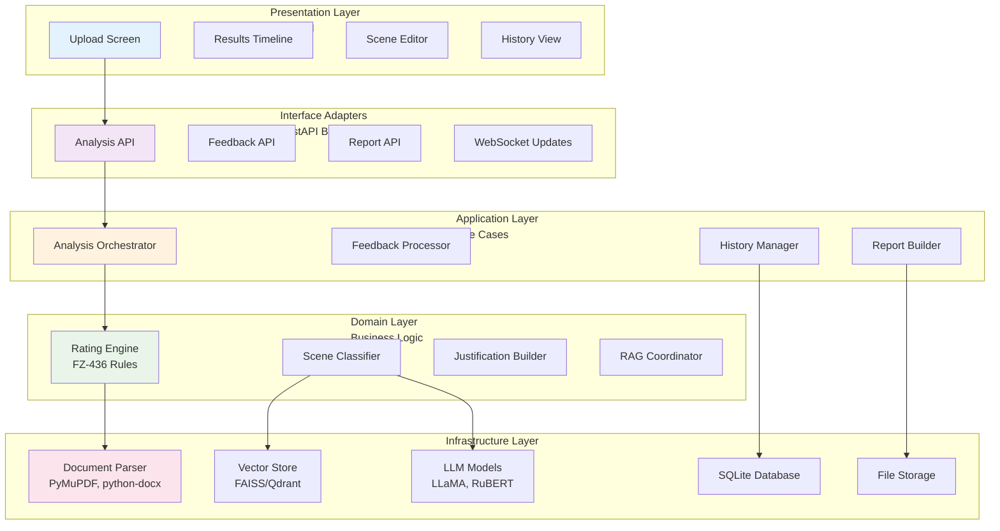
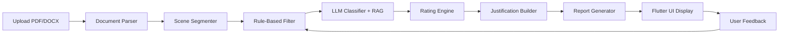

# ScriptRating: Autonomous Script Analysis for FZ-436 Compliance

[](LICENSE)
[](https://www.python.org/)
[](https://flutter.dev/)

ScriptRating is an autonomous offline system for analyzing cinematographic scripts against Russian FZ-436 age rating requirements. It automatically segments uploaded PDF/DOCX scripts, classifies content across five key categories (violence, sexual content, language, substances, frightening scenes), calculates final age ratings (0+/6+/12+/16+/18+), and generates comprehensive reports with legal justifications.

## 🎯 Project Overview and Goals

### Mission
To provide scriptwriters, producers, and content reviewers with an autonomous, offline-capable tool for FZ-436 compliance assessment, combining AI-powered analysis with legal corpus integration for transparent, explainable rating decisions.

### Core Objectives
- **FZ-436 Compliance**: Automated classification following Russian Federal Law №436-FZ rating criteria
- **Offline Operation**: Local LLM/ML models ensuring privacy and independence from external services
- **Autonomous Analysis**: End-to-end pipeline from document upload to report generation
- **Interactive Feedback**: Real-time user corrections with learning system for continuous improvement
- **Legal Transparency**: RAG-augmented justifications linking violations to specific regulatory articles

## ✨ Key Features

### Document Processing
- **Multi-format Support**: Native PDF/DOCX parsing with structure preservation
- **Intelligent Segmentation**: Automatic scene/dialogue extraction with screenplay format recognition
- **Content Normalization**: Text cleaning while maintaining critical formatting cues

### AI-Powered Analysis
- **Hybrid Classification**: Rule-based pre-screening + LLM assessment across 5 categories:
  - Violence (насилие)
  - Sexual Content (сексуальный контент)
  - Language (лексика)
  - Substances (вещества)
  - Frightening Scenes (пугающие сцены)
- **Severity Assessment**: None/Mild/Moderate/Severe ratings per category
- **RAG Integration**: Retrieval-augmented generation using legal corpus for explainable decisions

### Rating Calculation
- **FZ-436 Rules**: Automated rating assignment (0+/6+/12+/16+/18+) based on content severity
- **Target Rating Support**: Optional user-specified target rating with discrepancy highlighting
- **Problem Scene Identification**: Detailed violation mapping with scene numbers and categories

### Interactive Flutter UI
- **Cross-Platform**: Single codebase for web/desktop/mobile deployment
- **Visual Timeline**: Color-coded scene timeline with violation overlays
- **Real-time Editor**: Post-analysis script editing with instant re-analysis
- **Comprehensive History**: Analysis versioning with comparison capabilities
- **Feedback Interface**: One-click false positive marking and violation addition

### Reporting & Export
- **Multi-format Generation**: PDF/DOCX/JSON reports with professional formatting
- **Parents Guide Style**: Detailed scene-by-scene breakdowns with recommendations
- **Legal Citations**: Direct references to FZ-436 articles and regulatory sources
- **Visual Analytics**: Charts and timelines for content distribution analysis

### Learning System
- **User Corrections**: Interactive feedback incorporation into RAG knowledge base
- **Continuous Improvement**: Vector store updates from validated user inputs
- **Audit Trail**: Complete history of analysis versions and modifications
- **Offline Learning**: Local model fine-tuning from accumulated corrections

## 🏗️ Architecture

### High-Level Architecture


### Clean Architecture Layers
The system follows Clean Architecture principles with strict dependency inversion:

- **Presentation Layer**: Flutter UI with Riverpod state management
- **Interface Adapters**: FastAPI controllers with Pydantic DTOs
- **Application Layer**: Use case orchestration with Celery background tasks
- **Domain Layer**: Pure business logic with FZ-436 rating rules
- **Infrastructure Layer**: External dependencies (models, databases, file systems)

### Data Flow Pipeline


For detailed architectural documentation, see:
- [`docs/architecture.md`](docs/architecture.md) - Complete system architecture
- [`docs/diagrams/clean_architecture_layers.md`](docs/diagrams/clean_architecture_layers.md) - Layered architecture breakdown
- [`docs/diagrams/overall_data_flow.md`](docs/diagrams/overall_data_flow.md) - System data flow
- [`docs/diagrams/rag_pipeline.md`](docs/diagrams/rag_pipeline.md) - RAG integration details

## 🚀 Installation and Setup

### Prerequisites
- **Python 3.10+** with PyTorch support (CUDA recommended for GPU acceleration)
- **Flutter SDK 3.19+** for cross-platform UI compilation
- **Redis** (optional, for background task queuing with Celery)
- **Vector Database**: FAISS (CPU) or Qdrant (recommended for metadata filtering)

### Backend Setup

1. **Clone and Install Dependencies**
   ```bash
   git clone <repository-url>
   cd script-rating
   pip install -r requirements.txt
   ```

2. **Download Models**
   ```bash
   # LLM Models (quantized for offline use)
   python scripts/download_models.py --llm llama-2-13b-chat-q4
   python scripts/download_models.py --embeddings multilingual-e5-large

   # Local classifiers (fallback for CPU-only operation)
   python scripts/download_models.py --classifier rubert-base-multilabel
   ```

3. **Initialize RAG Corpus**
   ```bash
   # Process legal documents and examples
   python scripts/build_rag_corpus.py --source data/legal_docs/ --output vectorstore/

   # Validate corpus
   python scripts/validate_corpus.py --path vectorstore/
   ```

4. **Database Setup**
   ```bash
   # Initialize SQLite database
   python scripts/init_database.py
   ```

### Frontend Setup

1. **Flutter Installation**
   ```bash
   flutter doctor  # Verify installation
   flutter pub get  # Install dependencies
   ```

2. **Build for Target Platform**
   ```bash
   # Web deployment
   flutter build web --release

   # Desktop (Windows/macOS/Linux)
   flutter build windows --release

   # Mobile (iOS/Android)
   flutter build apk --release
   ```

### Configuration
Create `config.yaml`:
```yaml
backend:
  host: localhost
  port: 8000
  models_path: ./models
  vectorstore_path: ./vectorstore

rag:
  vector_db: qdrant  # or faiss
  embedding_model: intfloat/multilingual-e5-large
  corpus_sources:
    - data/fz436/
    - data/guidelines/
    - data/examples/

ui:
  theme: material3
  default_language: ru
```

## 📖 Usage Guide

### Basic Workflow

1. **Launch Application**
   ```bash
   # Start backend
   uvicorn app.main:app --host 0.0.0.0 --port 8000

   # Serve Flutter web app (or run native)
   cd flutter && flutter run -d chrome
   ```

2. **Upload Script**
   - Drag & drop PDF/DOCX file
   - Optional: Specify target rating (0+/6+/12+/16+/18+)
   - Select analysis model profile (fast/accurate/balanced)

3. **Analysis Process**
   - Real-time progress updates via WebSocket
   - Automatic scene segmentation and classification
   - RAG-enhanced justifications with legal citations

4. **Review Results**
   - Interactive timeline with color-coded violations
   - Category breakdown with severity indicators
   - Detailed scene-by-scene analysis

5. **Provide Feedback**
   - Mark false positives (automatically ignored in re-rating)
   - Add missed violations
   - Edit scene text for re-analysis

6. **Export Report**
   - Download PDF/DOCX report
   - JSON data for integration
   - Includes legal citations and recommendations

### Advanced Features

#### Target Rating Analysis
Specify desired rating to identify content that prevents achieving target:
```bash
curl -X POST http://localhost:8000/analyze \
  -F "file=@script.pdf" \
  -F "target_rating=12+"
```

#### Interactive Editing
Modify problematic scenes and instantly re-analyze:
- Direct text editing in Flutter UI
- Automatic diff detection
- Incremental re-classification

#### History Management
- Version comparison between analyses
- Correction tracking over time
- Bulk export of analysis history

## 📚 Module Documentation

Detailed technical specifications for each system component:

### Core Processing Pipeline
1. **[Document Parser](docs/modules/document_parser.md)** - PDF/DOCX extraction with structure preservation
2. **[Scene Segmenter](docs/modules/scene_segmenter.md)** - Intelligent screenplay segmentation
3. **[Rule-Based Filter](docs/modules/rule_based_filter.md)** - Fast pre-screening for violations
4. **[LLM Classifier](docs/modules/llm_classifier.md)** - AI content classification with RAG augmentation
5. **[Rating Engine](docs/modules/rating_engine.md)** - FZ-436 compliant rating calculation

### Output Generation
6. **[Justification Builder](docs/modules/justification_builder.md)** - Detailed explanations with citations
7. **[Report Generator](docs/modules/report_generator.md)** - Multi-format report creation
8. **[History Manager](docs/modules/history_manager.md)** - Analysis versioning and audit trails

### Advanced Features
9. **[RAG Orchestrator](docs/modules/rag_orchestrator.md)** - Vector database and retrieval management
10. **[Feedback Processor](docs/modules/feedback_processor.md)** - User correction integration
11. **[Flutter UI](docs/modules/flutter_ui.md)** - Cross-platform user interface

## 🤝 Contributing

### Development Setup
1. Follow the architecture guidelines in [`docs/architecture.md`](docs/architecture.md)
2. Implement new features using Clean Architecture principles
3. Add comprehensive tests for all modules
4. Update documentation for any architectural changes

### Code Standards
- **Python**: PEP 8 with type hints, async/await patterns
- **Flutter**: Effective Dart guidelines, Riverpod for state management
- **Documentation**: Clear module interfaces, Mermaid diagrams for workflows
- **Testing**: Unit tests + integration tests, focus on offline operation

### Pull Request Process
1. Create feature branch from `develop`
2. Implement with comprehensive tests
3. Update relevant documentation
4. Ensure offline functionality remains intact
5. Request review from architecture team

## 🗺️ Roadmap

### Phase 1: MVP (Current)
- ✅ Core analysis pipeline (parser → classifier → rating)
- ✅ Basic Flutter UI with timeline visualization
- ✅ RAG integration with legal corpus
- ✅ PDF/DOCX report generation
- ✅ SQLite history management

### Phase 2: Enhanced Features (Q2 2025)
- 🔄 Advanced scene editor with collaborative features
- 🔄 Real-time multi-user analysis sessions
- 🔄 Enhanced RAG with user feedback learning
- 🔄 Mobile app optimization
- 🔄 Bulk analysis capabilities

### Phase 3: Enterprise Features (Q3 2025)
- 📋 Integration APIs for production pipelines
- 📋 Advanced analytics dashboard
- 📋 Custom rule sets for different markets
- 📋 Automated compliance workflows
- 📋 Multi-language script support

### Phase 4: AI Advancement (Q4 2025)
- 🤖 Fine-tuned models for Russian content
- 🤖 Advanced multimodal analysis (images, audio cues)
- 🤖 Predictive rating suggestions
- 🤖 Automated content modification recommendations

## 📄 License

All rights reserved. This project contains proprietary intellectual property for automated content rating systems. Redistribution and commercial use require explicit permission from the copyright holder.

## 📞 Support

For technical documentation, see [`docs/README.md`](docs/README.md). For implementation details, refer to individual module documentation linked above.

