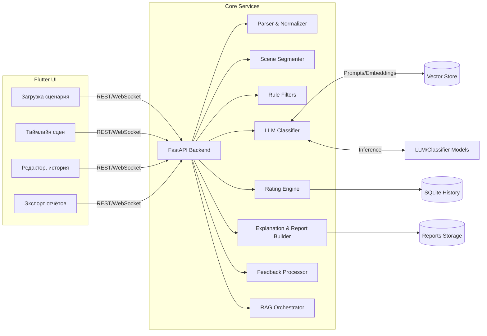
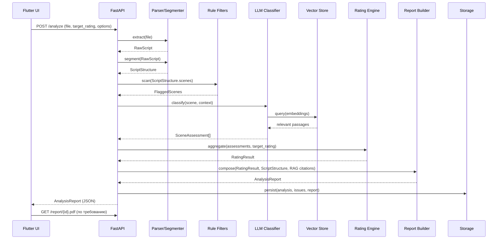
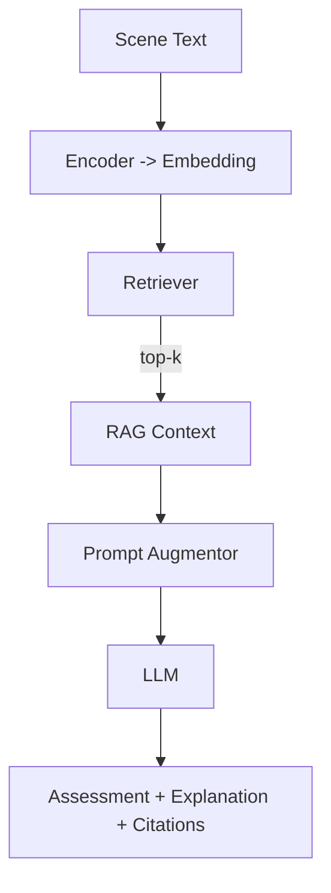

# Архитектура ScriptRating

Документ описывает целевую архитектуру сервиса ScriptRating, поддерживающего автоматическую проверку сценариев, RAG‑подсистему обоснований и Flutter‑фронтенд. Материал агрегирует функциональные требования исходного проектного документа и дополняет их детализацией по модулям, схемами взаимодействия и ключевыми инженерными решениями.

---

## 1. Контекст и цели
- **Проблема**: сценаристам и продюсерам необходим оперативный анализ сценариев на соответствие ФЗ‑436 (0+/6+/12+/16+/18+) с указанием проблемных сцен и рекомендаций по корректировке.
- **Решение**: автономное приложение (он‑прем или локальное рабочее место), которое:
  - принимает PDF/DOCX;
  - сегментирует сценарий на сцены и реплики;
  - классифицирует контент по пяти шкалам (насилие, сексуальный контент, лексика, алкоголь/наркотики, пугающие сцены);
  - выводит итоговый рейтинг и отчёт в стиле Parents Guide;
  - использует RAG-векторное хранилище для правовых обоснований и примеров;
  - предоставляет Flutter UI с интерактивной обратной связью и редактором.
- **Ограничения**: офлайн‑режим по умолчанию, локальные модели (≤80 ГБ VRAM), время анализа сценария ≤5 минут.

---

## 2. Высокоуровневая архитектура

### Ключевые технологические решения
- **Frontend**: Flutter (single codebase → web/desktop/mobile), Material 3, Riverpod/BLoC, пакеты `timelines`, `syncfusion_flutter_charts`, `flutter_quill`.
- **Backend**: FastAPI (routers, dependency injection, Pydantic схемы), Celery + Redis для фоновых задач, Uvicorn как ASGI сервер.
- **ML**: PyTorch + Hugging Face Transformers; квантизованные LLaMA/RuBERT для локального inference; bitsandbytes для 4/8‑бит представлений.
- **RAG**: FAISS или Qdrant для векторного хранилища; `intfloat/multilingual-e5-large` или подобные эмбеддинги; собственный корпус нормативных текстов, типовых эпизодов, пользовательских корректировок.
- **Хранение**: SQLite (результаты анализов, настройки, история); файловое хранилище отчётов; volume для моделей и снимков векторного индекса.
- **Инфраструктура**: Docker/Docker Compose, GPU‑совместимые базовые образы, поддержка офлайн пула моделей, CI для сборок Flutter и тестов backend.

---

## 3. Функциональные модули

### 3.1 Parser & Normalizer
- **Назначение**: извлечение содержимого из PDF/DOCX с сохранением структуры страниц и параграфов.
- **Вход**: загруженный файл сценария, параметры кодировки.
- **Выход**: `RawScript` (текст, страницы, параграфы, метаданные).
- **Инструменты**: PyMuPDF (PDF), python-docx (DOCX), chardet (fallback).
- **Пред/пост условие**: наличие более 1 сцены; аномальные файлы (слишком короткие/битые) отклоняются.

### 3.2 Scene & Dialogue Segmenter
- **Назначение**: деление сценария на сцены и реплики.
- **Вход**: `RawScript`.
- **Выход**: `ScriptStructure` (список `Scene { heading, number, range, action[], dialogues[] }`).
- **Логика**:
  - регулярные выражения по шаблонам `INT./EXT.` и альтернативам;
  - попытка чтения стилевых тегов DOCX (Heading);
  - выделение имён персонажей (CAPS) и их реплик.
- **Метрики**: точность сегментации сцена/реплика; контроль числа сцен (~40–80 для полнометражных сценариев).

### 3.3 Rule Filters (Pre-screen)
- **Назначение**: быстрый поиск потенциалов нарушений до обращения к LLM.
- **Вход**: сцена/диалог.
- **Выход**: `FlaggedScene` (категории с флагами).
- **Инструменты**: словари мата, наркотиков, грубых слов, паттерны насилия, regex для событий.
- **Решения**: словари хранятся в конфигурации, поддерживаются регулярные выражения и морфология (Natasha/SpaCy).

### 3.4 LLM Classifier
- **Назначение**: оценка сцен по пяти шкалам (`None/Mild/Moderate/Severe`).
- **Вход**: `FlaggedScene`/`Scene`.
- **Выход**: `SceneAssessment`.
- **Стратегия**:
  - генерация промпта со списком категорий и требованиями к формату ответа;
  - подмешивание RAG контекста (пункты закона, примеры из базы);
  - fallback на локальные мультилейбл‑классификаторы при отсутствии GPU.
- **Модели**: LLaMA‑2 13B/33B (инструкция на русском), дообученная RuBERT, quant-int4.
- **Оптимизации**: батчирование сцен, прогрев модели при старте, кэширование результатов для повторных запусков.

### 3.5 Rating Engine
- **Назначение**: агрегировать сцены и вычислить итоговый возрастной рейтинг.
- **Вход**: список `SceneAssessment`, целевой рейтинг пользователя (опционально).
- **Выход**: `RatingResult { rating, reasons[], problem_scenes[] }`.
- **Правила**:
  - Severe ⇒ 18+;
  - Moderate по критичным категориям ⇒ 16+ (с учётом частоты эпизодов);
  - Mild ⇒ ≥12+; отсутствие нарушений ⇒ 0+/6+ (в зависимости от содержания);
  - при наличии целевого рейтинга — подсветка несоответствий и генерация советов.

### 3.6 Explanation & Report Builder
- **Назначение**: готовить аннотации, рекомендации и экспортные артефакты.
- **Вход**: `RatingResult`, `ScriptStructure`.
- **Выход**: `AnalysisReport` (JSON, PDF/DOCX).
- **Функции**:
  - генерация Parents Guide bullet list;
  - связывание нарушений с фрагментами текста (цитаты, номера сцен/страниц);
  - построение диаграмм (matplotlib) и таймлайнов;
  - экспорт через python-docx/ReportLab.
- **Интеграция с RAG**: включение выдержек нормативных актов, ссылок на базу знаний (ID документов в векторном хранилище).

### 3.7 Feedback Processor
- **Назначение**: обрабатывать пользовательские отметки (ложные/новые нарушения).
- **Действия**:
  - помечает эпизоды `ignored=true`, пересчитывает рейтинг;
  - добавляет новые `user_added` issues;
  - сохраняет корректировки в истории и в RAG‑сборнике (для дальнейшего обучения).

### 3.8 RAG Orchestrator
- **Назначение**: связывать анализ с векторным хранилищем.
- **Компоненты**:
  - `CorpusBuilder`: готовит эмбеддинги законов, методичек, эталонных сцен, пользовательских правок.
  - `Retriever`: по запросу (сцена, категория) возвращает релевантные документы.
  - `Prompt Augmentor`: аккуратно встраивает выдержки в промпт LLM (строгий формат, указание источника).
  - `Citation Manager`: добавляет ссылки на документы в отчёт/интерфейс.
- **Хранилище**: FAISS–flat или HNSW, либо Qdrant (поддержка метаданных).

### 3.9 History Manager & Storage
- **Назначение**: вести учёт запусков анализа и артефактов.
- **Структура БД**:
  - `analyses(id, filename, created_at, final_rating, categories_json, report_path, target_rating, model_profile)`
  - `issues(id, analysis_id, scene_number, category, severity, description, recommendation, source)`
  - `user_actions(id, analysis_id, action_type, payload_json)`
- **Дополнительно**: хранение отчётов в `reports/`, логирование (structlog), архивирование старых запусков.

---

## 4. Пайплайн обработки сценария

---

## 5. Flutter UI: ключевые экраны и состояние

| Экран | Описание | Основные состояния |
|-------|----------|--------------------|
| **Загрузка** | Drag & drop файла, выбор целевого рейтинга, переключение профиля модели (локальная/внешняя), отображение прогресса анализа. | Idle → Uploading → Processing → Done/Error |
| **Результаты** | Заголовок с итоговым рейтингом и целевым, панель категорий, цветовой таймлайн, списки эпизодов в стиле Parents Guide, ссылки на выдержки закона. | SummaryView, CategoryFilter, SceneDetail |
| **Редактор** | Построчное редактирование сцен, синхронизация с backend, быстрый перезапуск анализа изменённых сцен. | Dirty/Pristine, Pending re-run |
| **История** | Перечень прошлых анализов, фильтрация, просмотр отчётов, сравнение версий. | Loaded, Selected, Compare |
| **Настройки** | Путь к моделям/весу, параметры RAG, интеграция с OpenRouter, тема интерфейса. | Saved/Unsaved |

Состояние хранится через Riverpod: `AnalysisState`, `TimelineFilter`, `EditorState`, `SettingsState`.

---

## 6. Интеграция RAG (Retrieval Augmented Generation)

### 6.1 Корпус знаний
- Федеральный закон №436‑ФЗ (структурированные выдержки по категориям).
- Методические рекомендации Роскомнадзора, Parents Guide IMDB, отраслевые гайды.
- Типовые примеры сцен с пометками (мат, насилие, секс и т.д.).
- Пользовательские корректировки (ложные/добавленные эпизоды) — анонимизированные.

### 6.2 Построение векторного индекса
1. Очистка и нормализация текстов (лемматизация, удаление служебных слов).
2. Генерация эмбеддингов (`multilingual-e5-large`, `sentence-transformers/stsb-xlm-r`).
3. Сохранение пар `embedding + metadata` в FAISS/Qdrant (HNSW для быстрого поиска).
4. Добавление классификаторов по тегам (`category`, `severity`, `source`).

### 6.3 Использование в пайплайне

- Для каждой сцены система получает top‑k (обычно 3–5) релевантных документов.
- Контекст встраивается в промпт: указывается источник, выдержка, сопоставление с категорией.
- Результаты (оценка, обоснование, ссылки) возвращаются LLM и сохраняются в отчёте/UI.
- Дополнительно: контекст передаётся в Recommendation Engine для генерации советов (например, «см. пункт 3 статьи 8 ФЗ‑436»).

### 6.4 Обновление корпуса
- После пользовательских правок (добавленные нарушения) текст сцены и комментарии отправляются в `CorpusBuilder` → создаются новые эмбеддинги → индекс обновляется инкрементально.
- Плановая переиндексация при добавлении новых нормативных документов.

---

## 7. Потоки обратной связи

| Действие пользователя | Обработка | Эффект |
|----------------------|-----------|--------|
| Пометить ложное срабатывание | `Feedback Processor` ставит `ignored=true`, рейтинг пересчитывается, запись сохраняется в истории | Сцена исключается, возможное снижение рейтинга |
| Добавить нарушение | Создаётся issue с `source=user`, добавляется в отчёт и историю, optional: отправляется в RAG корпус | Рейтинг может повыситься, рекомендации обновляются |
| Редактировать сцену | Текст пересохраняется, анализ запускается повторно (дифф или full), результаты версии фиксируются | Цикл «правка → анализ» закрывается в интерфейсе |
| Повторный экспорт | Используются актуальные данные, генерируются новые отчёты (PDF/DOCX) | Обновлённые обоснования и диаграммы |

---

## 8. Нефункциональные характеристики и тестирование

| Характеристика | Цель | Подход |
|----------------|------|--------|
| Производительность | ≤5 минут на сценарий ~20–30 тыс. слов | батчирование сцен, кэширование эмбеддингов, квантизованные модели |
| Надёжность | Контроль ошибок парсинга и inference | обработка исключений, retry, тесты на повреждённых файлах |
| Качество классификации | F1 ≥ 0.85 по ключевым категориям | датасеты с ручной разметкой, метрики на валидации, A/B моделей |
| ЭкспExplainability | Каждое нарушение сопровождается цитатой и ссылкой | RAG + сохранение источников |
| Тесты | Юнит, интеграционные, snapshot | pytest, тесты Flutter (golden), e2e сценариев |

---

## 9. Таблица модулей и связей

| Модуль | Описание | Взаимодействия | Ключевые решения |
|--------|----------|-----------------|------------------|
| `parser` | Извлекает и нормализует текст | получает файл от API, отдаёт `RawScript` | PyMuPDF, python-docx, контроль кодировок |
| `segmenter` | Делит на сцены/реплики | работает после parser, отдаёт `ScriptStructure` | regex, анализ стилей, поддержка нестандартных сцен |
| `rule_filters` | Словарный предусмотр | принимает сцены, помечает категории | конфигурируемые словари, морфология |
| `llm_classifier` | Вызывает LLM/ML | использует RAG контекст, возвращает оценки | локальные модели, batch inference |
| `rating_engine` | Агрегирует оценки | получает assessments, отдаёт рейтинг | таблица переходов severity→категория |
| `explanation_builder` | Пишет аннотации, отчёты | использует результаты, сцены, RAG ссылки | шаблоны + генерация LLM, визуализации |
| `feedback_processor` | Обрабатывает корректировки | обновляет данные в БД и RAG | быстрый пересчёт без повторного inference |
| `history_manager` | Хранит результаты | взаимодействует с SQLite/файлами | миграции, архивация |
| `rag_orchestrator` | Управляет emb/retrieval | синхронизирует корпус, обслуживает запросы | FAISS/Qdrant, обновления индекса |
| `flutter_ui` | Клиентский интерфейс | работает с REST/WebSocket API | Riverpod/BLoC, адаптивная верстка, intl |

---

## 10. Дорожная карта реализации
1. **MVP Backend**: parser → segmenter → rule filters → rating engine → JSON без LLM.
2. **Интеграция LLM**: подключение локальной модели, тестирование промптов, набор baseline RAG корпуса.
3. **Отчёты и история**: генерация PDF/DOCX, SQLite миграции, выгрузка отчётов.
4. **Flutter UI**: загрузка и прогресс, сводка + таймлайн, базовый редактируемый текст.
5. **RAG Расширение**: построение полноценных эмбеддингов, citations в отчётах/UI.
6. **Обратная связь и переобучение**: функционал ложных/добавленных нарушений, обновление корпуса.
7. **Оптимизация и тестирование**: юнит/интеграционные тесты, перформанс, CI/CD.

---

## 11. Дополнительные материалы
- `script_structure.json` — извлечённая структура исходного документа (использовать для сопоставления требований и реализации).
- Источники нормативных данных: ФЗ‑436, постановления РКН, Parents Guide IMDB (см. ссылки в проектной документации).
- Рекомендуемые наборы тестовых сценариев: семейные фильмы (0–12), подростковые драмы (12–16), триллеры/ужасы (16–18), сценарии с явным матом.

---

## 12. Заключение
Предложенная архитектура сочетает чистую модульность, офлайн‑ориентированность, поддержку RAG и расширяемость. Flutter‑фронтенд обеспечивает доступность сценаристов и продюсеров, а гибридная ML/RAG подсистема позволяет обосновывать решения ссылками на нормативы и референтные примеры. Документ служит руководством по реализации и дальнейшему развитию ScriptRating.
