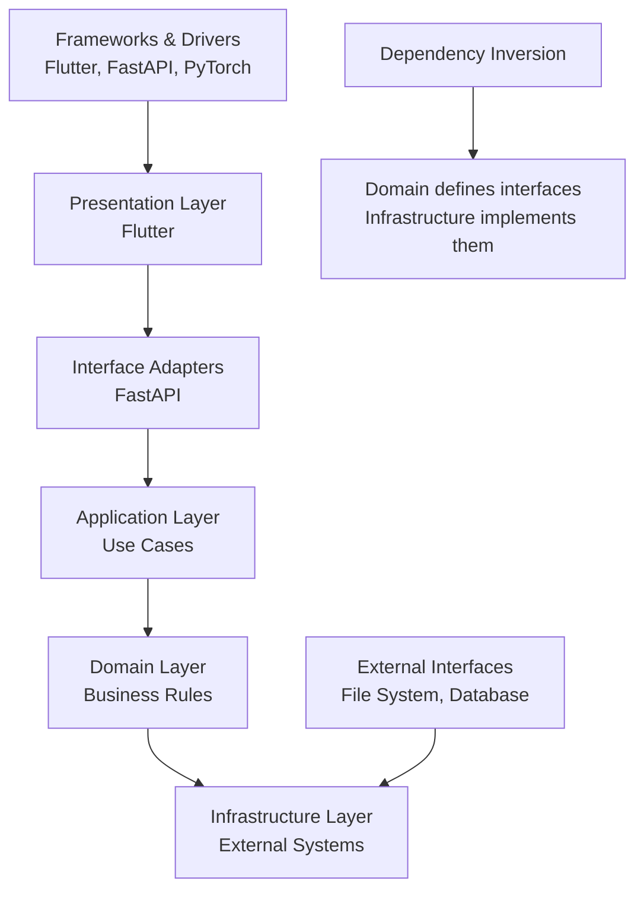
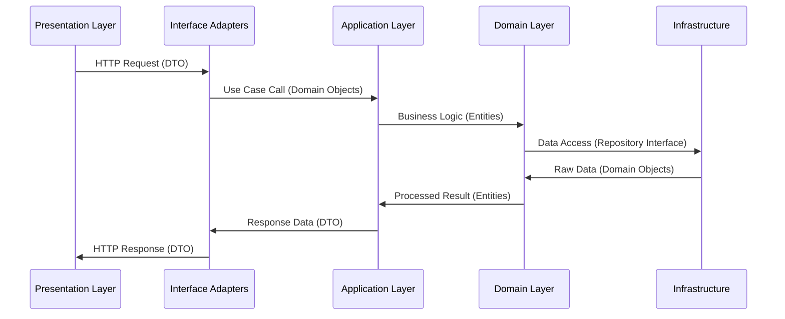

# Clean Architecture Layers Diagram

## Architectural Layer Overview

```mermaid
graph TB
    subgraph "Presentation Layer<br/>Flutter UI"
        P1[Upload Screen]
        P2[Results Screen]
        P3[Editor Screen]
        P4[History Screen]
        P5[Riverpod State Management]
        P6[Material 3 UI Components]
    end

    subgraph "Interface Adapters Layer<br/>FastAPI Controllers"
        I1[Analysis Controller<br/>POST /analyze]
        I2[Feedback Controller<br/>PUT /issues/{id}]
        I3[Report Controller<br/>GET /reports/{id}]
        I4[History Controller<br/>GET /analyses]
        I5[Pydantic Models<br/>Request/Response DTOs]
        I6[WebSocket Handler<br/>Real-time Updates]
    end

    subgraph "Application Layer<br/>Use Cases & Services"
        A1[Analysis Orchestrator<br/>Pipeline Coordination]
        A2[Feedback Processor<br/>User Corrections]
        A3[Report Builder<br/>Document Generation]
        A4[History Manager<br/>Audit Trail]
        A5[RAG Coordinator<br/>Context Retrieval]
        A6[Celery Task Queue<br/>Background Processing]
    end

    subgraph "Domain Layer<br/>Business Logic"
        D1[Rating Engine<br/>FZ-436 Rules]
        D2[Scene Classifier<br/>Content Analysis]
        D3[Justification Builder<br/>Explanation Logic]
        D4[Validation Rules<br/>Business Constraints]
        D5[Domain Entities<br/>Script, Scene, Assessment]
        D6[Domain Services<br/>Cross-Cutting Concerns]
    end

    subgraph "Infrastructure Layer<br/>External Dependencies"
        Infra1[Document Parser<br/>PyMuPDF, python-docx]
        Infra2[Vector Store<br/>FAISS/Qdrant]
        Infra3[LLM Models<br/>LLaMA, RuBERT]
        Infra4[Database<br/>SQLite]
        Infra5[File Storage<br/>Reports Directory]
        Infra6[Configuration<br/>Settings, Dictionaries]
    end

    P1 --> I1
    P2 --> I2
    P3 --> I1
    P4 --> I4

    I1 --> A1
    I2 --> A2
    I3 --> A3
    I4 --> A4

    A1 --> D1
    A1 --> D2
    A2 --> D3
    A3 --> D4
    A5 --> D5

    D1 --> Infra1
    D2 --> Infra2
    D2 --> Infra3
    D3 --> Infra4
    A4 --> Infra4
    A3 --> Infra5

    style P1 fill:#e3f2fd
    style I1 fill:#f3e5f5
    style A1 fill:#fff3e0
    style D1 fill:#e8f5e8
    style Infra1 fill:#fce4ec
```

## Layer Dependencies (Clean Architecture Rules)



## Detailed Layer Interactions

| Layer | Responsibility | Technologies | Dependencies |
|-------|----------------|--------------|--------------|
| **Presentation** | User interface and interaction | Flutter, Riverpod, Material 3 | Interface Adapters (inward) |
| **Interface Adapters** | API controllers, data transformation | FastAPI, Pydantic, WebSocket | Application Layer (inward), Presentation (outward) |
| **Application** | Use case orchestration, workflow management | Python services, Celery | Domain Layer (inward), Interface Adapters (outward) |
| **Domain** | Core business logic, rules, entities | Pure Python classes | Infrastructure (inward via interfaces) |
| **Infrastructure** | External systems, data persistence | SQLite, FAISS, file system | Domain interfaces (implements), Application (outward) |

## Data Flow Through Layers



## Key Clean Architecture Principles Applied

### Dependency Inversion
- Domain layer defines repository interfaces
- Infrastructure layer implements concrete repositories
- Application layer depends on abstractions, not concretions

### Single Responsibility
- Each layer has one primary concern
- Controllers handle HTTP concerns
- Use cases handle application workflow
- Domain objects handle business rules
- Infrastructure handles external systems

### Testability
- Domain layer is framework-independent
- Business logic can be unit tested without external dependencies
- Mocks can replace infrastructure implementations
- UI and infrastructure layers can be swapped without affecting core logic

### Framework Independence
- Business rules don't depend on Flutter or FastAPI specifics
- External frameworks are isolated in outer layers
- Core logic remains unchanged if UI framework changes