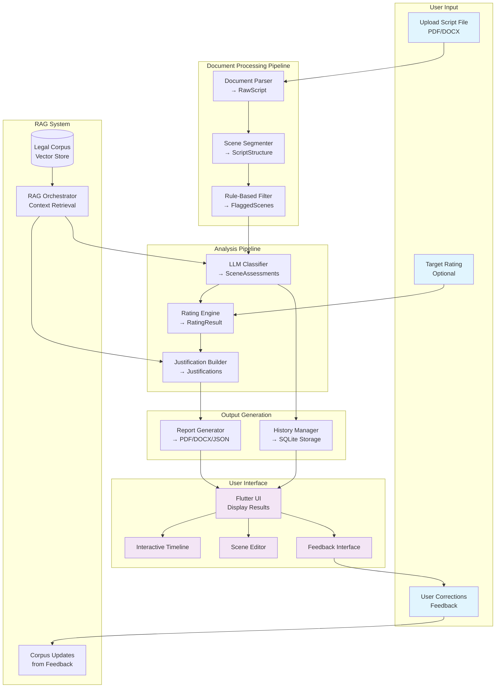
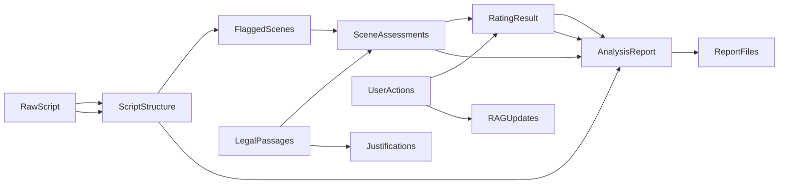

# Overall Data Flow Diagram

## System-Level Data Flow

## Data Object Flow

## Key Data Transformations

| Stage | Input Data | Processing | Output Data |
|-------|------------|------------|-------------|
| **Document Processing** | PDF/DOCX file | Text extraction, structure preservation | RawScript (text, pages, paragraphs) |
| **Scene Segmentation** | RawScript | Regex parsing, style analysis | ScriptStructure (scenes, dialogues) |
| **Rule Filtering** | ScriptStructure | Dictionary matching, pattern detection | FlaggedScenes (potential violations) |
| **LLM Classification** | FlaggedScenes + RAG context | Model inference with legal context | SceneAssessments (severity ratings) |
| **Rating Aggregation** | SceneAssessments | Rule-based rating calculation | RatingResult (final rating, reasons) |
| **Justification Building** | RatingResult + ScriptStructure | Citation linking, explanation generation | Justifications (detailed explanations) |
| **Report Generation** | AnalysisReport | Template formatting, visualization | ReportFiles (PDF/DOCX/JSON) |
| **Feedback Processing** | User corrections | Rating recalculation, corpus updates | Updated RatingResult + RAGUpdates |

## Data Persistence Points

- **Analysis Results**: SQLite database (analyses, issues, user_actions tables)
- **Reports**: File system storage (reports/ directory)
- **RAG Corpus**: Vector database (FAISS/Qdrant with embeddings)
- **Models**: Local storage for quantized LLaMA/RuBERT models
- **Configuration**: Settings for rule dictionaries, model profiles