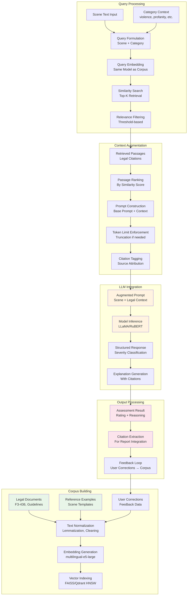
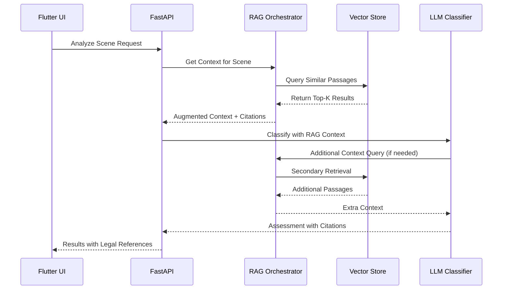
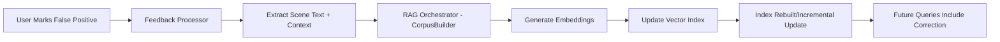
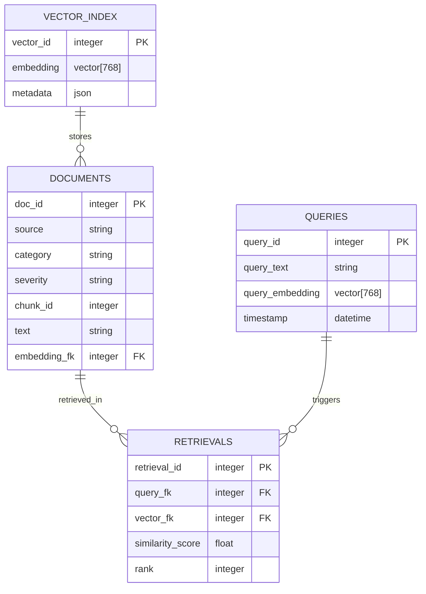
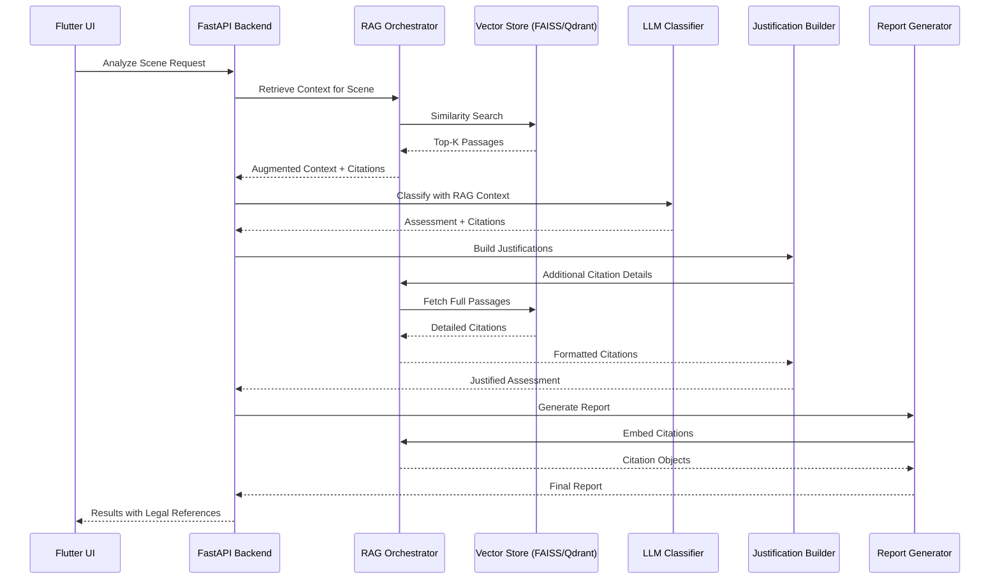

# RAG Pipeline Diagram

## Complete RAG Workflow

## RAG Component Interactions

## Corpus Update Flow

## RAG Pipeline Workflow (Detailed)

```mermaid
flowchart TD
    subgraph Corpus_Building
        A1[Input Documents<br/>FЗ-436, Scripts, Feedback]
        A2[Text Normalization<br/>Lemmatization, Cleaning]
        A3[Chunking<br/>256-512 Tokens, Overlap]
        A4[Embedding Generation<br/>multilingual-e5-large]
        A5[Vector Indexing<br/>FAISS/Qdrant]
    end

    subgraph Query_Processing
        B1[Scene Text + Category]
        B2[Query Embedding<br/>Prefix 'query:']
        B3[Similarity Search<br/>Top-K with Threshold]
        B4[Re-ranking<br/>Cross-Encoder]
        B5[Metadata Filtering<br/>Source, Severity]
    end

    subgraph Context_Augmentation
        C1[Retrieved Passages<br/>With Scores & Metadata]
        C2[Prompt Construction<br/>Context + Scene Text]
        C3[Token Management<br/>Truncate if Needed]
        C4[Citation Formatting<br/>Source Attribution]
    end

    subgraph LLM_Integration
        D1[Augmented Prompt<br/>Context + Query]
        D2[LLM Inference<br/>Classification + Reasoning]
        D3[Response Parsing<br/>Severity Scores, Citations]
    end

    subgraph Output_Processing
        E1[Assessment Result<br/>Rating, Justifications]
        E2[Citation Storage<br/>For Reports]
        E3[Feedback Loop<br/>Update Corpus]
    end

    A1 --> A2 --> A3 --> A4 --> A5
    B1 --> B2 --> B3 --> B4 --> B5 --> C1
    C1 --> C2 --> C3 --> C4 --> D1 --> D2 --> D3 --> E1 --> E2
    E2 --> E3 --> A1

    style A1 fill:#e8f5e8
    style B1 fill:#fff3e0
    style C1 fill:#e3f2fd
    style D1 fill:#fce4ec
    style E1 fill:#f3e5f5
```

## Vector Database Schema

## Integration Points with LLM Classifier and Justification Builder

## Key RAG Design Patterns

| Component | Purpose | Implementation | Key Decisions |
|-----------|---------|----------------|---------------|
| **Corpus Builder** | Initialize and maintain knowledge base | Text preprocessing, embedding generation, vector indexing | Multilingual embeddings for Russian legal texts, incremental updates |
| **Retriever** | Find relevant context for queries | Similarity search in vector space, metadata filtering | Top-K retrieval (3-5 passages), similarity thresholds |
| **Prompt Augmentor** | Integrate context into LLM prompts | Structured prompt formatting, citation insertion | Strict token limits, source attribution formatting |
| **Citation Manager** | Track and format legal references | Source mapping, report integration | Maintain traceability to original documents |

## Data Flow in RAG Pipeline

1. **Corpus Ingestion**: Legal texts → Normalization → Embeddings → Vector Index
2. **Query Processing**: Scene text + category → Query embedding → Similarity search → Relevant passages
3. **Context Integration**: Retrieved passages → Prompt augmentation → LLM input with citations
4. **Response Processing**: LLM output → Citation extraction → Assessment with legal backing
5. **Learning Loop**: User feedback → Corpus updates → Improved future retrievals