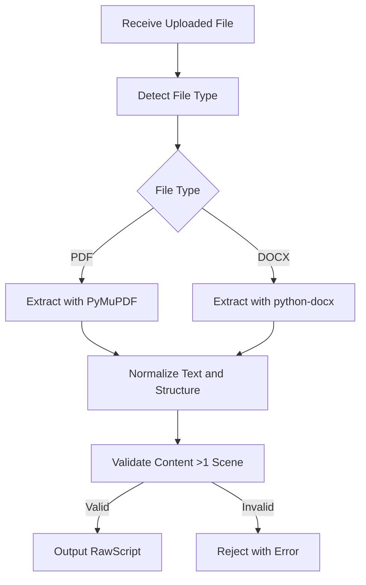

# Document Parser Module

## Detailed Description
The Document Parser module is responsible for extracting and normalizing content from uploaded script files (PDF/DOCX) while preserving the structure of pages and paragraphs. It serves as the entry point for script analysis, ensuring that raw text is accurately extracted without loss of formatting that could affect downstream segmentation.

### Input
- Uploaded file (PDF or DOCX format)
- Parameters for encoding detection and normalization

### Output
- `RawScript` object containing:
  - Plain text content
  - Page structure with ranges
  - Paragraph metadata
  - File metadata (size, type, etc.)

## Internal Workflow Diagram

## Integration Points
- **Input from**: Flutter UI (file upload via API)
- **Output to**: Scene Segmenter (provides RawScript for segmentation)
- **Dependencies**: None direct, but integrated into FastAPI backend pipeline

## Key Design Decisions
- Use specialized libraries (PyMuPDF for PDF, python-docx for DOCX) for robust extraction
- Implement encoding detection with chardet for fallback handling
- Validate minimum content requirements to prevent processing invalid files
- Maintain page and paragraph structure to support accurate scene segmentation
- Handle edge cases like corrupted files or unsupported formats with graceful error handling