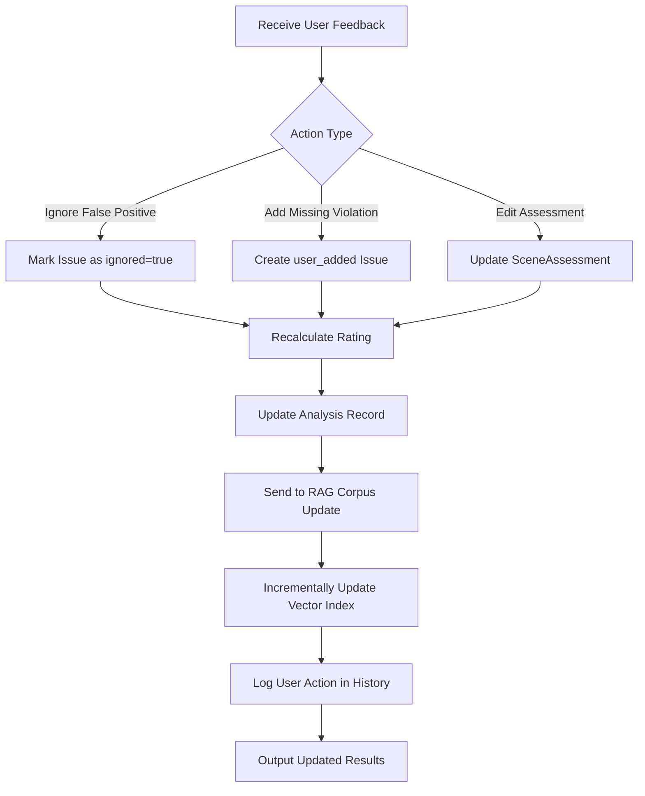

# Feedback Processor Module

## Detailed Description
The Feedback Processor handles user corrections and annotations to analysis results. It allows marking false positives as ignored, adding missed violations, and incorporating user feedback into the RAG knowledge base for improved future analyses.

### Input
- User actions (ignore violation, add violation, edit assessment)
- Scene identifiers and modification details
- Optional comments explaining the correction

### Output
- Updated `RatingResult` with corrected assessments
- Modified analysis records for re-rating
- RAG corpus updates for learning from corrections

## Internal Workflow Diagram

## Integration Points
- **Input from**: Flutter UI (user corrections via API)
- **Output to**: Rating Engine (recalculation), RAG Orchestrator (corpus updates), History Manager (action logging)
- **Dependencies**: Analysis state management, RAG incremental updates

## Key Design Decisions
- Support real-time rating recalculation without full re-analysis
- Implement incremental RAG updates to incorporate user corrections
- Maintain audit trail of all user modifications
- Enable bulk operations for efficiency with multiple corrections
- Preserve original analysis while creating corrected versions