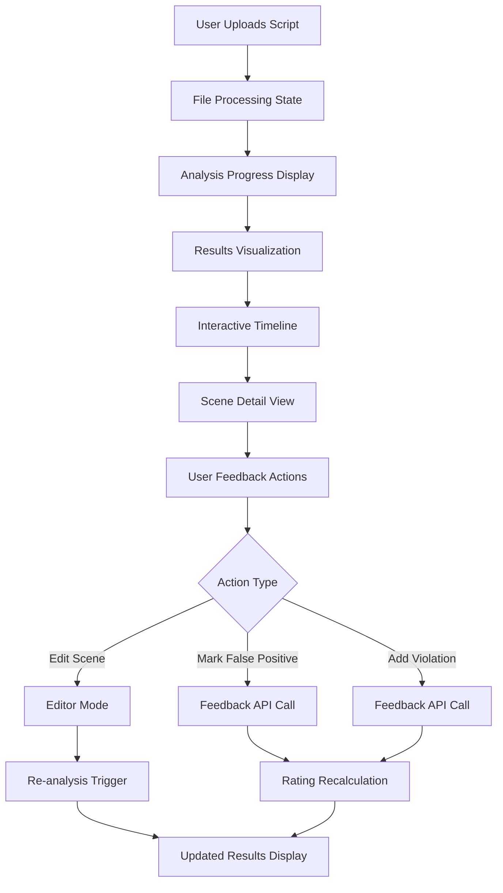
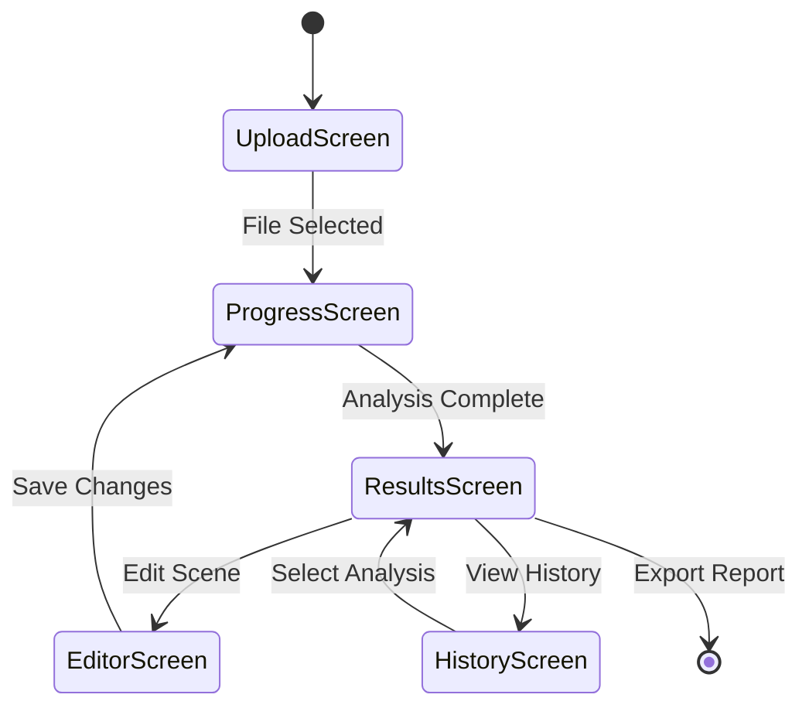

# Flutter UI Module

## Detailed Description
The Flutter UI provides a cross-platform interface for script analysis, featuring drag-and-drop file uploads, interactive timelines, editable scripts, and comprehensive result visualization. It serves as the primary user interface for scriptwriters, producers, and content reviewers.

### Input
- REST/WebSocket API responses from FastAPI backend
- User interactions (file uploads, edits, corrections)
- Analysis results and report data

### Output
- API requests for analysis operations
- User corrections and feedback
- Report download requests

## Internal Workflow Diagram

## Screen Architecture

## Integration Points
- **Input from**: FastAPI Backend (analysis results, progress updates)
- **Output to**: FastAPI Backend (analysis requests, feedback)
- **Dependencies**: Riverpod/BLoC for state management, syncfusion_flutter packages

## Key Design Decisions
- Implement single codebase approach for web/desktop/mobile deployment
- Use Riverpod for reactive state management across screens
- Provide real-time progress updates during analysis
- Enable collaborative editing with backend synchronization
- Support offline analysis queue with local model integration