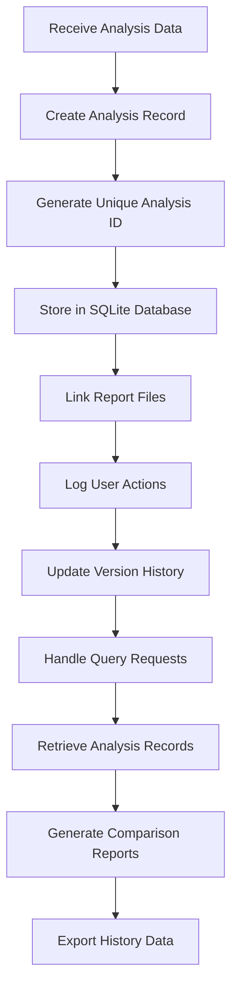
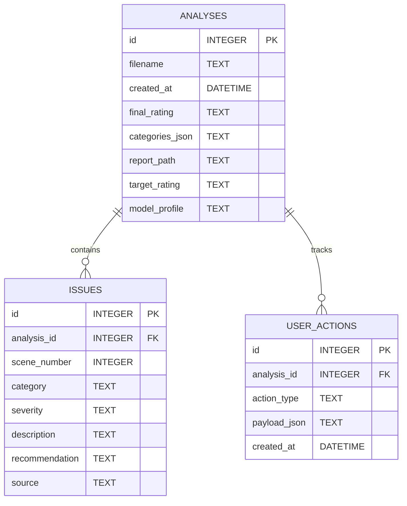

# History Manager Module

## Detailed Description
The History Manager maintains records of all script analyses, user actions, and generated reports. It provides version control, audit trails, and efficient querying for analysis history, enabling comparison between different analysis runs and tracking user corrections.

### Input
- Analysis results to store (complete or incremental updates)
- User action logs from Feedback Processor
- Report metadata and file paths
- Query parameters for history retrieval

### Output
- Analysis history records with full metadata
- Comparison reports between analysis versions
- Exportable history summaries
- Audit trails for compliance requirements

## Internal Workflow Diagram

## Database Schema

## Integration Points
- **Input from**: All analysis modules (results storage), Feedback Processor (action logging)
- **Output to**: Flutter UI (history display), Report Generator (comparison data)
- **Dependencies**: SQLite database, file system for report storage

## Key Design Decisions
- Use SQLite for portability and offline operation requirements
- Implement versioning to track analysis evolution with user corrections
- Maintain comprehensive audit trails for regulatory compliance
- Support efficient querying and filtering of historical data
- Enable report archiving and cleanup of old analyses