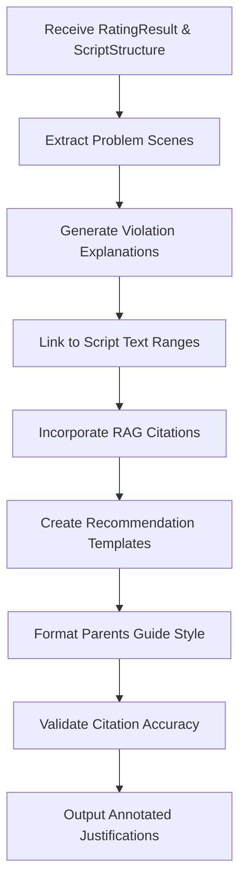

# Justification Builder Module

## Detailed Description
The Justification Builder module generates detailed explanations and recommendations for rating decisions. It creates Parents Guide-style annotations that link violations to specific script content, incorporating RAG citations to legal sources and reference materials.

### Input
- `RatingResult` from Rating Engine
- `ScriptStructure` for scene references
- RAG citations from LLM Classifier

### Output
- Annotated explanations for each rating decision
- Recommendations for content modification
- Citations linking to legal/regulatory sources
- Structured data for report generation

## Internal Workflow Diagram

## Integration Points
- **Input from**: Rating Engine (results) and RAG Orchestrator (citations)
- **Output to**: Report Generator (structured justifications)
- **Dependencies**: Citation management, template systems

## Key Design Decisions
- Structure explanations around specific scene citations with page/scene numbers
- Integrate RAG citations directly into justifications for legal backing
- Use Parents Guide format with bullet points and category organization
- Generate actionable recommendations for content modification
- Maintain traceability between violations and source materials