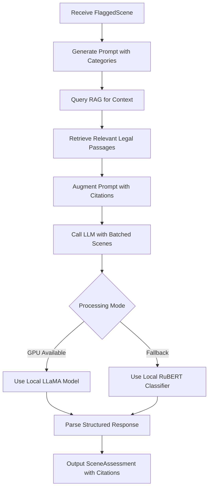

# LLM Classifier Module

## Detailed Description
The LLM Classifier evaluates scenes across five content categories (violence, sexual content, profanity, alcohol/drugs, scary scenes) using large language models. It provides detailed severity assessments with None/Mild/Moderate/Severe ratings, augmented by RAG context from legal and reference materials.

### Input
- `FlaggedScene` objects from Rule-Based Filter
- Optional scene context from ScriptStructure

### Output
- `SceneAssessment` objects containing:
  - Severity ratings for each of the five categories
  - Detailed explanations for each rating
  - Citations to RAG sources used in evaluation
  - Confidence scores for classifications

## Internal Workflow Diagram

## Integration Points
- **Input from**: Rule-Based Filter (flagged scenes) and RAG Orchestrator (context)
- **Output to**: Rating Engine (scene assessments for aggregation)
- **Dependencies**: Local LLM models, RAG vector store, prompt templates

## Key Design Decisions
- Implement prompt engineering with strict output format requirements
- Use RAG augmentation to include legal context and examples in prompts
- Support both GPU-accelerated LLaMA models and CPU fallback classifiers
- Enable batched processing for multiple scenes to optimize inference time
- Include citation tracking to maintain explainability
- Implement model warming and result caching for repeated analyses