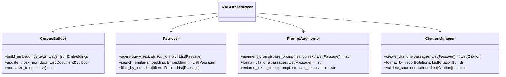

# RAG Orchestrator Module

## Detailed Description
The RAG Orchestrator manages the Retrieval Augmented Generation system, coordinating the vector database operations, embedding generation, and context retrieval for legal and reference materials. It provides relevant citations to support classification decisions and report justifications.

### Input
- Text queries (scene content, categories, legal questions)
- Corpus update requests (new documents, user feedback)
- Retrieval parameters (top-k, similarity thresholds)

### Output
- Retrieved passages with metadata and similarity scores
- Citation objects for report integration
- Corpus indexing confirmations

## 1) Vector Store Setup and Management (FAISS/Qdrant)

### Technology Choices
- **FAISS**: In-memory vector search library optimized for speed and low memory usage. Suitable for offline deployments with flat or HNSW indexing.
- **Qdrant**: Persistent vector database with REST API, metadata filtering, and horizontal scaling. Preferred for complex metadata queries and easier management in Python environments.

### Setup Specifications
#### FAISS Configuration
- **Installation**: `pip install faiss-cpu` or `faiss-gpu` (for CUDA support).
- **Index Types**:
  - `IndexFlatIP` for exact cosine similarity search (IP = Inner Product).
  - `IndexHNSW` for approximate nearest neighbor (ANN) with configurable M (links per node) and efConstruction/efSearch for speed-accuracy tradeoffs.
- **Persistence**: Use `faiss.write_index()` to save to disk and `faiss.read_index()` to load. Store in application data directory (e.g., `~/.scriptrating/vector_index.faiss`).
- **Memory Management**: Index size scales with vector count (768 dims for multilingual-e5-large ≈ 3GB for 1M vectors). Use mmap for large indices to avoid full loading.

#### Qdrant Configuration
- **Installation**: `pip install qdrant-client`. Run local server with Docker: `docker run -p 6333:6333 qdrant/qdrant`.
- **Collection Create**: JSON schema with vector dimensions (768), distance metric (Cosine), and payload fields:
  ```json
  {
    "name": "legal_corpus",
    "vectors": {"size": 768, "distance": "Cosine"},
    "payload_schema": {
      "source": {"data_type": "keyword"},
      "category": {"data_type": "keyword"},
      "severity": {"data_type": "keyword"},
      "chunk_id": {"data_type": "integer"},
      "text": {"data_type": "text"}
    }
  }
  ```
- **Offline Mode**: Embed Qdrant binary in application bundle or use local Docker container. Disable telemetry and external connections.

### Management Operations
- **Index Building**: Batch insert vectors (10k chunks at a time) with metadata. For FAISS, rebuild entire index on updates; for Qdrant, use incremental upserts.
- **Backup/Restore**: FAISS: copy index files. Qdrant: export collection snapshots via API.
- **Health Checks**: Verify index size, last update timestamp, and perform test queries on startup.
- **Scaling**: FAISS limited by RAM; Qdrant supports sharding for >10M vectors.

## 2) Embedding Generation for Regulatory Documents and Script Content

### Embedding Model Specifications
- **Model**: `intfloat/multilingual-e5-large` (Hugging Face). Supports 100+ languages, 512 token input, 768-dim output. Optimized for asymmetric retrieval (query vs. document).
- **Installation**: `pip install sentence-transformers`. Load via `SentenceTransformer(model_name)`.
- **Quantization**: Use 8-bit quantization (`load_in_8bit=True`) for offline operation on GPUs with <24GB VRAM.
- **Preprocessing**:
  - Normalize text: lowercase, remove extra whitespace, handle Cyrillic characters.
  - Chunking: Split documents into 256-512 token chunks with 50-token overlap using recursive text splitter (sentences > paragraphs > words).
  - Query Encoding: Prefix queries with "query: " for better retrieval performance.

### Document Processing Pipeline
#### Regulatory Documents (FЗ-436, Guidelines)
1. Parse PDFs/DOCX via Document Parser.
2. Extract sections: Split by articles, subsections, categories (violence, profanity, etc.).
3. Generate embeddings: Chunk text → encode → store with metadata (source="fz436", category="violence", severity="severe").
4. Initial Corpus: ~10k chunks (laws, examples, guidelines).

#### Script Content (Query Embeddings)
1. For scene queries: Extract scene text + category (e.g., "scene: violence in bar fight").
2. Encode as query: Model.encode("query: " + text, normalize_embeddings=True).
3. For feedback updates: Treat user-added scenes as new documents.

### Performance Considerations
- Batch encoding: Process 32-128 chunks per batch to leverage GPU parallelism.
- Caching: Store embeddings in Parquet files for quick reloading without re-encoding.

## 3) Retrieval Strategies and Context Augmentation for LLM Prompts

### Retrieval Strategies
- **Similarity Search**: Cosine similarity on FAISS/Qdrant, return top-K (3-5) passages with scores >0.7 threshold.
- **Hybrid Retrieval**: Combine vector similarity with keyword filtering (e.g., category="profanity").
- **Re-ranking**: Use cross-encoder (e.g., `ms-marco-MiniLM-L-6-v2`) for top-10 results to improve precision.
- **Metadata Filtering**: Filter by source (law vs. example), severity, or user-added flags.

### Context Augmentation
- **Prompt Format**:
  ```
  Legal Context for Classification:
  - Source: FЗ-436 Article 8.1
  - Text: [passage]
  - Relevance: [score]

  Classify the following scene: [scene_text]
  Categories: [violence, profanity, etc.]
  ```
- **Token Limits**: Max 2048 tokens per prompt. Truncate passages if needed, prioritizing high-score items.
- **Citation Tracking**: Embed source IDs in responses for traceability (e.g., "See FЗ-436 §3").

### Integration with LLM Classifier
- Pre-classification: Retrieve context before LLM inference.
- Post-classification: If confidence low, perform secondary retrieval with refined query.

## 4) Corpus Updates from User Feedback and New Documents

### Feedback-Driven Updates
- **User Actions**: Mark false positive → extract scene text as negative example.
- **Incremental Indexing**:
  - FAISS: Add vectors to index or rebuild subset.
  - Qdrant: Upsert new points with metadata (source="user_feedback", category="ignored").
- **Deduplication**: Check similarity to existing vectors; skip if >0.95 match.

### New Document Ingestion
- **Pipeline**: Document Parser → Text Normalization → Chunking → Embedding → Store.
- **Batch Updates**: Schedule nightly rebuilds for new regulatory docs.
- **Versioning**: Maintain index versions; allow rollback to previous corpus.

## 5) Performance Optimizations for Offline Operation

### Memory Optimization
- **Quantized Embeddings**: Use int8/float16 models; store indices in memory-mapped files.
- **Index Sharding**: Split large FAISS indices into shards loaded on-demand.
- **CPU Fallback**: FAISS supports CPU-only mode; limit batch sizes to 1GB RAM.

### Speed Optimizations
- **Pre-computed Queries**: Cache frequent category queries (e.g., "violence").
- **Async Retrieval**: Use threads for vector search while LLM processes.
- **Approximate Search**: HNSW with ef=64 for 10x speedup over exact search.

### Offline-Specific Features
- **No Internet Dependency**: All models and indices bundled locally.
- **Low-Power Mode**: Reduce embedding dims to 384 or use lighter model (e.g., `distiluse-base-multilingual-cased`).
- **Benchmark Targets**: Retrieval <500ms per query; index build <10min for 100k chunks.

## RAG Pipeline Workflow Diagram


## Vector Database Schema Diagram


## Integration Points with LLM Classifier and Justification Builder Diagram


## Internal Workflow Diagram


## Class Diagram


## Integration Points
- **Input from**: LLM Classifier (context queries), Feedback Processor (corpus updates)
- **Output to**: LLM Classifier (augmented prompts), Report Generator (citations)
- **Dependencies**: Vector store (FAISS/Qdrant), embedding models

## Key Design Decisions
- Modular architecture with separate components for different RAG functions
- Support multiple vector stores (FAISS for speed, Qdrant for metadata)
- Implement incremental index updates for user feedback incorporation
- Use multilingual embedding models for Russian legal content
- Maintain citation traceability for regulatory compliance