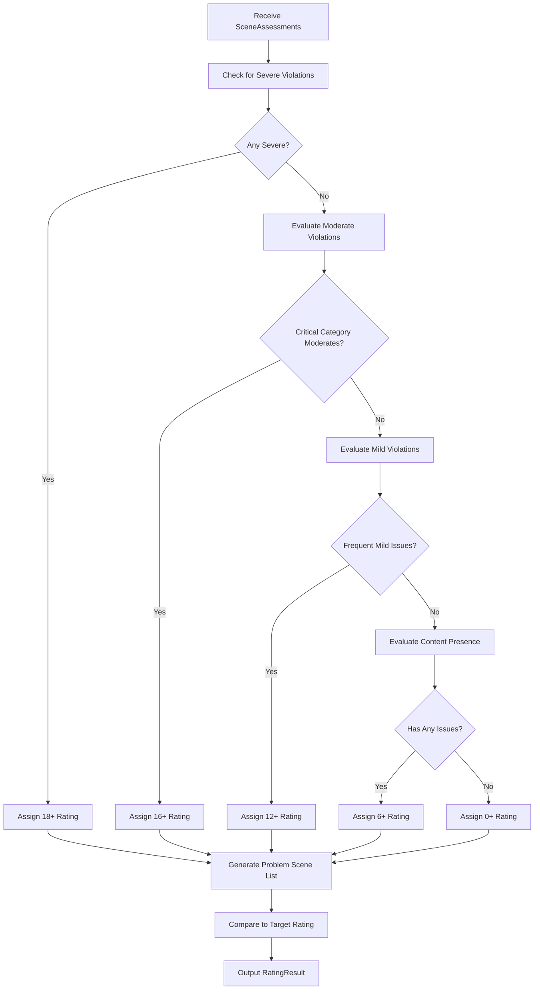

# Rating Engine Module

## Detailed Description
The Rating Engine aggregates individual scene assessments into a final age-appropriate rating following the Russian FZ-436 classification system. It applies predefined rules to determine overall content suitability based on the severity and frequency of violations across all categories.

### Input
- Array of `SceneAssessment` objects from LLM Classifier
- Optional target rating specified by user

### Output
- `RatingResult` object containing:
  - Final age rating (0+/6+/12+/16+/18+)
  - Array of reasons explaining the rating
  - List of problem scenes with details
  - Comparison to target rating if specified

## Internal Workflow Diagram

## Integration Points
- **Input from**: LLM Classifier (assessment results)
- **Output to**: Justification Builder (rating for report generation)
- **Dependencies**: Rating rules configuration, target rating comparison logic

## Key Design Decisions
- Implement strict hierarchy: Severe → 18+, Moderate in critical categories → 16+
- Consider frequency of violations, not just presence
- Support target rating comparison for highlighting discrepancies
- Generate detailed problem scene lists with scene numbers and categories
- Enable configurable rating thresholds for different content types