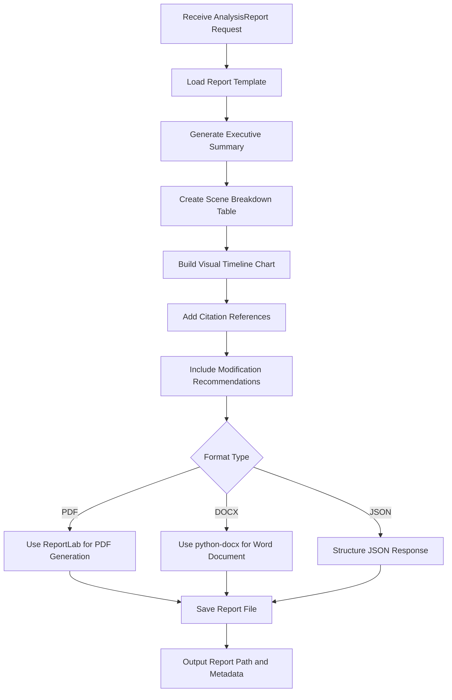

# Report Generator Module

## Detailed Description
The Report Generator creates comprehensive analysis reports in multiple formats (JSON, PDF, DOCX). It combines rating results, justifications, and visualizations to produce professional documents suitable for producers, censors, and regulatory compliance.

### Input
- `AnalysisReport` data containing rating, justifications, and scene details
- Format specification (JSON/PDF/DOCX)
- Optional branding/template preferences

### Output
- Formatted report files with:
  - Executive summary with final rating
  - Detailed scene-by-scene breakdown
  - Visual timeline of content violations
  - Citations to regulatory sources
  - Recommendations for modifications

## Internal Workflow Diagram

## Integration Points
- **Input from**: Justification Builder (structured explanations)
- **Output to**: History Manager (report storage) and Flutter UI (download links)
- **Dependencies**: Template files, visualization libraries (matplotlib)

## Key Design Decisions
- Support multiple export formats for different stakeholder needs
- Include interactive elements in digital formats where possible
- Use professional templates with consistent branding
- Generate charts and timelines for visual content analysis
- Maintain report versioning and metadata tracking