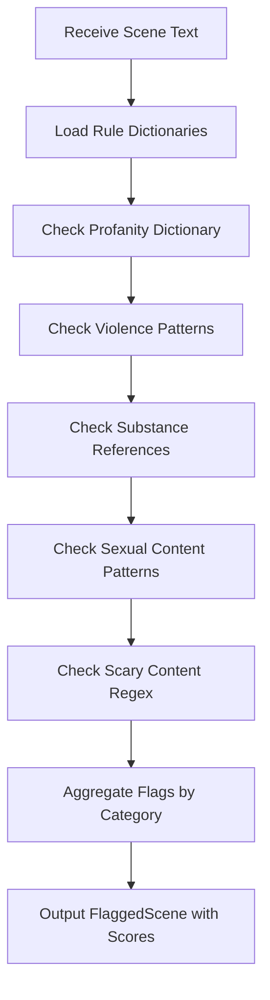

# Rule-Based Filter Module

## Detailed Description
The Rule-Based Filter serves as a fast pre-screening layer to identify potential content violations before invoking the more expensive LLM classifier. It performs dictionary-based and pattern-matching checks against configurable rule sets to flag scenes that may contain problematic content.

### Input
- Individual scene or dialogue text from ScriptStructure

### Output
- `FlaggedScene` object containing:
  - Categories with boolean flags for potential violations
  - Matched terms or patterns for each category
  - Confidence scores for rule-based detections

## Internal Workflow Diagram

## Integration Points
- **Input from**: Scene Segmenter (individual scenes for scanning)
- **Output to**: LLM Classifier (flagged scenes for detailed analysis)
- **Dependencies**: Configuration files containing dictionaries and regex patterns

## Key Design Decisions
- Implement configurable dictionaries for profanity, substances, and sensitive terms
- Use regex patterns for detecting violence and sexual content scenarios
- Support morphological analysis with Natasha/SpaCy for Russian language variations
- Provide confidence scoring to prioritize scenes for LLM review
- Enable easy updates to rule sets without code changes
- Include fallback patterns for common content variations