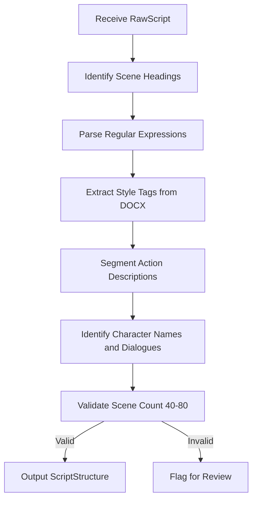

# Scene Segmenter Module

## Detailed Description
The Scene Segmenter module divides the normalized script into individual scenes and dialogue elements. It analyzes the RawScript output from the Document Parser to identify scene headings, action descriptions, and character dialogues, creating a structured representation that enables precise content analysis.

### Input
- `RawScript` object from Document Parser containing text and structural metadata

### Output
- `ScriptStructure` object containing:
  - List of `Scene` objects with headings, numbers, text ranges
  - Each scene includes action descriptions and dialogue arrays
  - Metadata about scene count and structure validity

## Internal Workflow Diagram

## Integration Points
- **Input from**: Document Parser (RawScript)
- **Output to**: Rule-Based Filter (ScriptStructure for pre-screening)
- **Dependencies**: Integrated into FastAPI backend, called sequentially after parsing

## Key Design Decisions
- Use regex patterns for standard screenplay formats (INT./EXT., scene numbers)
- Support both plain text and DOCX style-based heading detection
- Implement character name detection using CAPS formatting convention
- Include validation metrics for scene count to ensure realistic segmentation
- Maintain text ranges to enable precise referencing in reports and UI
- Handle non-standard screenplay formats with fallback patterns